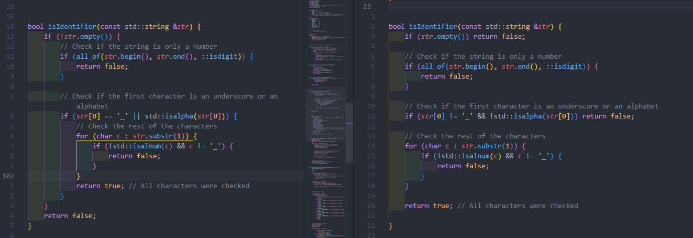

## Code Style, Readability, and Optimization

- Not sure why `vector<Token> tokens` was declared in `int main` only to be passed instantly to `check_Variable()`
- ~~`getType()` can use cascading switch-case statements instead to make it faster and cleaner like so:~~ Nevermind, I forgot you needed integral type

```C++
// int getType(string str) {
// 	switch (str) {
// 	case "int":
// 	case "char":
// 	case "double":
// 	case "float":
// 		return DATATYPE;
// 	case ",":
// 		return COMMA;
// 		// ... so on and so forth

// 	// you can even do it in one line like this:
// 	case ",": return COMMA;

// 	// then use default for ones that don't use ==
// 	// like so:
// 	default:
// 		if (isIdentifier(str)) return VARNAME;
// 	}
// }
```

- `getType` is also returning `TokenType` so might as well use that as the return type:		`TokenType getType(string str) {`
- Thus in `check_Variable()`, you can refactor this part:

```C++
int inputType = getType(token.identifier);
token.token_type = static_cast<TokenType>(inputType);
```

- in `check_Variable()`, I don't particularly see the need to have the two for-loops. They can be done in one go

```C++
for (const auto& identifier : parsed_string) {
	t.identifier = identifier;
	t.token_type = getType(identifier);
	tokens.push_back(t);
}
```

Additionally, with a constructor of

```C++
Token(string id, TokenType type) : identifier(id), token_type(type) {};
```

you can further turn your code to this (removing the initial `Token t` declaration as well)

```C++
for (const auto& identifier : parsed_string) {
	TokenType type = getType(identifier);
	tokens.push_back( Token(identifier, type) );
}
```

- `Token.token_state` is not used and I can't see how this can be used neither
- Rule of thumb: whenever one variable is compared using == to integer values, use switch-case
- enums are 0-based, so you can leave them as is like:

```C++
enum State{
    STAGE_0,
    STAGE_1, //check for datatype
    STAGE_2, //check for variable name
    STAGE_3, //if equal - check if it is an identifier, comma - go back to stage 2, or semicolon - go back to stage 1
};
```

- Don't apply this for now since it will take time, but next time, try to think of ways that the program shouldn't work or think of all the possible errors and handle it ASAP in order to avoid lots of nested code. This can be done through guard clauses then returning errors, or better yet, throwing errors and handling a custom exception in the `main` function.
  Example of refactored code to using guard clause (on the right)
  

## Staging comments

- In stage 1, I think checking of datatype and identifier (which is your VARNAME) should be separate
  Because this invalid code would be valid	
  myVar = 1;
- For stage 0, I think you meant `(currentState == STAGE_0 && (token.token_type == VARNAME || token.token_type == UNEXPECTED))`.
  Your current condition evaluates `currentState == STAGE_0 && token.token_type == VARNAME` first then the value of that OR'd with `|| token.token_type == UNEXPECTED`
  IE, even if it wasn't `STAGE_0` but `token.token_type == UNEXPECTED`, it would be true
- Line 253 in STAGE 0, the condition `(currentState != STAGE_2)` doesn't seem necessary since this will always be in STAGE_0
- TODO: When checking a literal, the proceeding token should only be a COMMA or SEMICOLON. Check for this one

*NOTE: I've added stylilstic_tips.cpp to show some code structure changes. Logic is still the same more or less. It was initially just for me, so I can read the logic more clearly, but might as well push it. The function declarations are just there to get rid of errors while I was writing it. If it has a function definition, then there was a stylistic improvement. This should serve only as a guide. They mostly reflect what I commented here*